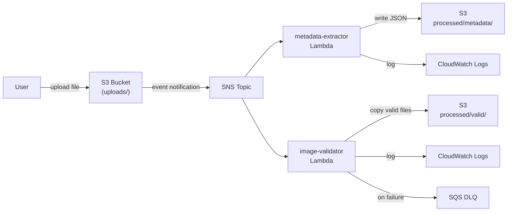

[](https://classroom.github.com/a/6-mBL2PW)
# Event-Driven Image Processing Pipeline

# 
## Introduction to Cloud Computing - University of Pittsburgh

## Project Overview

This project demonstrates event-driven architecture using AWS services. You will build a serverless pipeline that automatically processes images uploaded to S3 using two Lambda functions triggered via an SNS topic in a fan-out pattern.

When an image is uploaded to the `uploads/` prefix in your S3 bucket, an SNS notification fans out to two Lambda functions:
- **metadata-extractor** - extracts file metadata, logs to CloudWatch, and writes a JSON file to `processed/metadata/`
- **image-validator** - validates file type, copies valid files to `processed/valid/`, and sends invalid files to a Dead Letter Queue (DLQ)

## Architecture



## Project Structure

```
.
├── .github/workflows/
│   ├── deploy.yml              # CI/CD pipeline for building and deploying lambdas
│   └── grading.yml             # automated grading checks
├── docs/
│   ├── ecr-setup.md
│   ├── github-actions-setup.md
│   ├── lambda-setup.md
│   ├── local-dev.md
│   ├── s3-setup.md
│   └── sns-setup.md
├── hack/
│   ├── test-image.jpg          # sample image for testing
│   └── test.sh                 # end-to-end test script (used for grading)
├── lambda/
│   ├── image_validator/
│   │   ├── Dockerfile
│   │   ├── lambda_function.py  # TODO: implement validation logic
│   │   ├── test-event-invalid.json
│   │   └── test-event-valid.json
│   └── metadata_extractor/
│       ├── Dockerfile
│       ├── lambda_function.py  # TODO: implement metadata extraction
│       └── test-event.json
├── tests/
│   └── test_local.py           # unit tests with mocked boto3
└── README.md
```

## Prerequisites

- AWS Account
- GitHub Account
- AWS CLI installed and configured
- Docker Desktop installed

## What You Need to Implement

This project provides a skeleton with TODO sections. You must complete:

**1. Lambda Handler Code (2 files)**
- `lambda/metadata_extractor/lambda_function.py` - parse SNS event, extract and log S3 file metadata, write JSON to `processed/metadata/`
- `lambda/image_validator/lambda_function.py` - parse SNS event, validate file extension, copy valid files to `processed/valid/`, raise exception for invalid files

**2. Dockerfiles (2 files)** - provided, no changes needed
- `lambda/metadata_extractor/Dockerfile`
- `lambda/image_validator/Dockerfile`

**3. GitHub Actions Configuration**
- update `AWS_LAMBDA_ROLE_ARN` in `.github/workflows/deploy.yml`
- complete the TODO section for docker build/push commands
- add GitHub secrets: `AWS_ACCESS_KEY_ID` and `AWS_SECRET_ACCESS_KEY`

**4. AWS Infrastructure (follow setup guides in order)**
- create ECR repositories for each Lambda function
- create S3 bucket `cc-images-{your-pitt-username}` with `uploads/` prefix
- create Lambda execution role with S3 (GetObject + PutObject), CloudWatch, and SQS permissions
- create SNS topic `image-upload-notifications` and subscribe both Lambda functions
- configure S3 event notifications to publish to SNS
- create SQS dead letter queue `image-processing-dlq` and attach to image-validator

## Setup Guides

Follow these guides in order. Some steps reference resources created in later guides — the docs will tell you when to jump ahead and come back.

1. **[Local Development Guide](./docs/local-dev.md)** - develop and test your Lambda functions locally
2. **[ECR Setup](./docs/ecr-setup.md)** - create container repositories for Lambda functions
3. **[S3 Setup](./docs/s3-setup.md)** - create and configure your S3 bucket
4. **[Lambda Setup](./docs/lambda-setup.md)** - create Lambda functions, execution roles, and DLQ
5. **[SNS Setup](./docs/sns-setup.md)** - configure SNS topic and subscriptions
6. **[GitHub Actions Setup](./docs/github-actions-setup.md)** - automate deployment with GitHub Actions

## Testing

### End-to-End Test Script

An automated test script is provided in the `hack/` directory. **This is the script used for grading.** Please note you should use hack when your infrastructure is in place in AWS.

```bash
cd hack
./test.sh <your-pitt-username>
```

The script will:
- upload a valid image to `uploads/`
- upload an invalid file (.txt) to `uploads/`
- check that `processed/metadata/{filename}.json` exists in S3
- check that `processed/valid/{filename}` exists in S3
- check the DLQ for the invalid file message

### Manual Testing

```bash
# upload a valid image
aws s3 cp test-image.jpg s3://cc-images-<your-pitt-username>/uploads/test.jpg

# upload an invalid file
echo "not an image" > test.txt
aws s3 cp test.txt s3://cc-images-<your-pitt-username>/uploads/test.txt

# wait ~15 seconds, then check processed output
aws s3 ls s3://cc-images-<your-pitt-username>/processed/metadata/
aws s3 ls s3://cc-images-<your-pitt-username>/processed/valid/

# download and inspect the metadata JSON
aws s3 cp s3://cc-images-<your-pitt-username>/processed/metadata/test.json -

# check DLQ for invalid file message
aws sqs receive-message --queue-url https://sqs.us-east-1.amazonaws.com/<account-id>/image-processing-dlq
```

### Expected S3 Output

**metadata-extractor** writes `processed/metadata/test.json`:
```json
{
    "file": "uploads/test.jpg",
    "bucket": "cc-images-{username}",
    "size": 102400,
    "upload_time": "2026-03-15T10:30:00Z"
}
```

**image-validator** copies valid files to `processed/valid/test.jpg`

### Expected CloudWatch Output

**metadata-extractor logs:**
```
[METADATA] File: uploads/test.jpg
[METADATA] Bucket: cc-images-{username}
[METADATA] Size: 102400 bytes
[METADATA] Upload Time: 2026-03-15T10:30:00Z
```

**image-validator logs (valid file):**
```
[VALID] uploads/test.jpg is a valid image file
```

**image-validator logs (invalid file):**
```
[INVALID] uploads/test.txt is not a valid image type
```

## Grading Requirements

This assignment is worth 15 points total:

| Component | Points |
|-----------|--------|
| **Infrastructure Setup** | **5** |
| - S3 bucket exists with correct naming | 1 |
| - S3 event notification configured for `uploads/` prefix | 1 |
| - SNS topic exists and receives S3 events | 1 |
| - both Lambda functions subscribed to SNS topic | 1 |
| - DLQ configured for `image-validator` Lambda | 1 |
| **metadata-extractor Lambda** | **5** |
| - correctly parses nested SNS → S3 event structure | 1 |
| - writes metadata JSON to `processed/metadata/` | 2 |
| - logs in correct `[METADATA]` format to CloudWatch | 2 |
| **image-validator Lambda** | **5** |
| - correctly identifies valid image extensions | 1 |
| - copies valid files to `processed/valid/` | 1 |
| - raises exception for invalid files (triggers DLQ) | 1 |
| - invalid files appear in DLQ | 2 |
| **Total** | **15** |

## Submission

1. Push all your code to the main branch
2. Submit to Canvas a `s3-bucket.txt` file with your bucket name:
```text
cc-images-<your-pitt-username>
```
